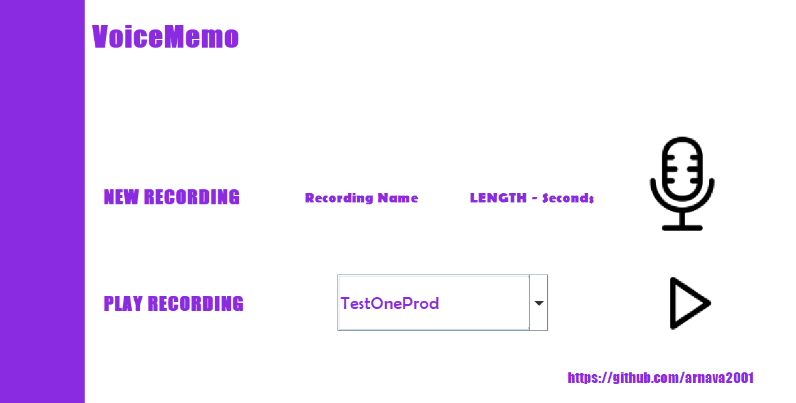

# VoiceMemo (Windows)
Java Swing Application to record, store, and playback voice messages
 To use: designate a length of time to record for and the name of your message and then hit play to begin recording. After recording is finished, your new voicememo will
be be visible in the dropdown combo box below. To playback one of your recordings, select the desired recording and press play. Recordings will also be saved to your C drive under
a folder called "JavaVoiceMemo"

